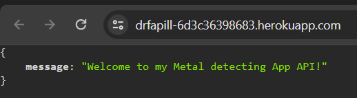

# Lost-Legends - API

This is the backend API for the Lost Legends Frontend React app. It contains the models and logic to allow the frontend application to perform CRUD operations.

Lost Legends is a content-sharing platform designed for metal detecting enthusiasts: users can sign up, share their remarkable discoveries, save and react to finds, as well as follow or unfollow other users.

## Table of Content

## Database
The Lost-Legends API utilizes the following database schema:

