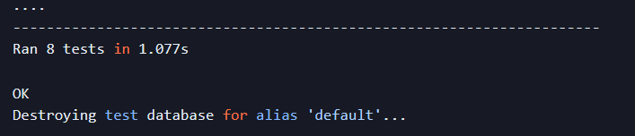

# Lost-Legends - API

This is the backend API for the Lost Legends Frontend React app. It contains the models and logic to allow the frontend application to perform CRUD operations.

Lost Legends is a content-sharing platform designed for metal detecting enthusiasts: users can sign up, share their remarkable discoveries, save and react to finds, as well as follow or unfollow other users.

## Table of Content

## Database
The Lost-Legends API utilizes the following database schema:

## Wishlist

This model represents the list of posts that a user wants to keep track of. It is related to the User model (as the owner of the wishlist) and the Post model.

## Comments

This model represents comments made by users. It is associated with the User model (as the owner of the comment) and the Post model. In addition to the content of the comment, it keeps track of the times when each comment was created and last updated.

## Following

This model maintains the following relationships between users. It is related to the User model twice, once for the owner of the follow (the follower) and once for the followed user. A timestamp of each follow event is also stored.

## Likes

This model captures the likes given by users to a post. It is linked to the User and Post. It also records the time when each like event was created.

## Posts

This model represents the posts made by users. It is related to the User model as the owner of the post. It keeps track of the times when each post was created and last updated, along with the content of the post including the title, image, location information and the era type of find.

## Detectorists

This model extends the User model with additional detectorist-specific information such as their name, profile image, and other personal details. It also keeps timestamps of when each detectorist profile was created and last updated. The creation of a Detectorist object is automatically triggered by the creation of a User object, thanks to the post_save signal connected to the create_detectorist function.

## Favorites

This model represents the list of posts that a user wants to keep track of. It is related to the User model (as the owner of the Favorites) and the Post model.

Each of these models serves a unique purpose and together they support a range of features in your application, from user registration and social networking to content creation and curation.

## Bugs

### Known bugs (Samsung Galaxy A34)

- There is a known bug identified in the initial codebase that has been acknowledged and will not be addressed prior to the project submission.

  - Description:
  After registering for a new account, the user is redirected to the login page. However, the user is unable to log in with the correct username and password. This issue occurs only on mobile phones and not on desktops.
  - Steps to Reproduce:
    - Go to the login page on a mobile phone
    - Enter the correct username and password.
    - Click on the submit button.
    - Observe the error.
  - Expected Behavior:
    - The user should be redirected to the home page with the logged-in navbar displayed.
  - Desktop:
    - No issues encountered on desktop.
  - Smartphone:
    - Samsung Galaxy A34

## Fixed bugs
Here is a summary of the identified bugs along with brief descriptions of their fixes.
| **Bug** | **Description** | **Fix** |
| --- | --- | --- |
| **Filter function is not working** | Added filter used in frontend | Implemented the filter function in the frontend to ensure proper data filtering. |
| **favorites_count showing NaN in posts** | Correct connection in queryset for posts | Fixed the connection in the queryset to accurately count and display the number of favorites. |

## Testing

All tests for the Lost-Legends API have been passed, demonstrating its readiness for deployment and public use.

### Code Validation
  - [PEP8](https://pep8ci.herokuapp.com/) is a style guide for writing Python code to ensure consistency and readability. It provides guidelines on how to format code, naming conventions for variables and functions, and other best practices. Following PEP 8 helps to improve code quality, readability, and maintainability.

 #### drf-api

 | **Tested**    | **Result**    | **View Result** | **Pass** |
|---------------|---------------|-----------------|----------|
| serializers   | No errors     | Result          | ✅       |
| settings      | No errors     | Result          | ✅       |
| urls          | No errors     | Result          | ✅       |
| views         | No errors     | Result          | ✅       |
    

#### Wishlist

| **Tested**    | **Result**    | **View Result** | **Pass** |
|---------------|---------------|-----------------|----------|
| models        | No errors     | Result          | ✅       |
| serializers   | No errors     | Result          | ✅       |
| urls          | No errors     | Result          | ✅       |
| views         | No errors     | Result          | ✅      

#### Comments

| **Tested**    | **Result**    | **View Result** | **Pass** |
|---------------|---------------|-----------------|----------|
| models        | No errors     | Result          | ✅       |
| serializers   | No errors     | Result          | ✅       |
| urls          | No errors     | Result          | ✅       |
| views         | No errors     | Result          | ✅  

#### Following     
| **Tested**    | **Result**    | **View Result** | **Pass** |
|---------------|---------------|-----------------|----------|
| models        | No errors     | Result          | ✅       |
| serializers   | No errors     | Result          | ✅       |
| urls          | No errors     | Result          | ✅       |
| views         | No errors     | Result          | ✅       |

#### Likes

| **Tested**    | **Result**    | **View Result** | **Pass** |
|---------------|---------------|-----------------|----------|
| models        | No errors     | Result          | ✅       |
| serializers   | No errors     | Result          | ✅       |
| urls          | No errors     | Result          | ✅       |
| views         | No errors     | Result          | ✅       |

#### Favorites

| **Tested**    | **Result**    | **View Result** | **Pass** |
|---------------|---------------|-----------------|----------|
| models        | No errors     | Result          | ✅       |
| serializers   | No errors     | Result          | ✅       |
| urls          | No errors     | Result          | ✅       |
| views         | No errors     | Result          | ✅       |

#### Posts

| **Tested**    | **Result**    | **View Result** | **Pass** |
|---------------|---------------|-----------------|----------|
| models        | No errors     | Result          | ✅       |
| serializers   | No errors     | Result          | ✅       |
| tests         | No errors     | Result          | ✅       |
| urls          | No errors     | Result          | ✅       |
| views         | No errors     | Result          | ✅       |

#### Detectorists

| **Tested**    | **Result**    | **View Result** | **Pass** |
|---------------|---------------|-----------------|----------|
| models        | No errors     | Result          | ✅       |
| serializers   | No errors     | Result          | ✅       |
| tests         | No errors     | Result          | ✅       |
| urls          | No errors     | Result          | ✅       |
| views         | No errors     | Result          | ✅       |

### Automated testing

The application have used some automated testing to ensure the functionality of the Posts API endpoints as well as the consistent extension of the User model with the Detectorist model. Here is an overview of the tests:

Post Listing: To verify that the API correctly lists the posts available. Post Creation: To check whether an authenticated user can successfully create a post. Unauthorized Post Creation: To ensure that unauthenticated users are not allowed to create posts. Post Retrieval: The test verify that posts can be retrieved using valid identifiers. Additionally, it will check that the system correctly handles retrieval requests for non-existent posts. Post Updates: To confirm that a user can update their own posts, and importantly, they cannot modify other user's posts. User-Detectorist Consistency: We run tests to confirm that each user is always extended with the Detectorist model.

Upon successful execution of the tests, you should see output similar to the following:

### Manual testing

During the manual testing of the API, the following steps were performed:
- Ensured that all URL paths were created correctly and functioning without any errors.
- Verification of CRUD Functionality:
  -  Verified the functionality of Create, Read, Update, and Delete operations for various entities such as posts, wishlists, favorites, comments, followers, likes, and detectorists.
  - Created new items and confirmed the proper functioning of the corresponding URLs.
  - Verified the Edit functionality.
  - Tested the delete function to ensure its correctness.
  - Check delete function.
- Validation of Post Search Functionality:
  - Tested the search functionality specifically for posts.
  - Ensured that the search feature for posts was functioning as expected.

### URL Testing

| **Tested**             | **Expected result**                | **Result**           | **Pass** |
|------------------------|------------------------------------|----------------------|----------|
| Root URL               | Show welcome message               | Works as expected    | ✅       |
| /wishlist              | Display wishlist                   | Works as expected    | ✅       |
| /wishlist/{id}         | Display wishlist detail            | Works as expected    | ✅       |
| /favorites             | Display favorites list             | Works as expected    | ✅       |
| /favorites/{id}        | Display favorite detail            | Works as expected    | ✅       |
| /posts                 | Display posts list                 | Works as expected    | ✅       |
| /posts/{id}            | Display posts detail               | Works as expected    | ✅       |
| /comments              | Display comments list              | Works as expected    | ✅       |
| /comments/{id}         | Display comment detail             | Works as expected    | ✅       |
| /likes                 | Display likes list                 | Works as expected    | ✅       |
| /likes/{id}            | Display like detail                | Works as expected    | ✅       |
| /detectorists          | Display detectorists list          | Works as expected    | ✅       |
| /detectorists/{id}     | Display detectorist detail         | Works as expected    | ✅       |
| /followers             | Display followers list             | Works as expected    | ✅       |
| /followers/{id}        | Display follower detail            | Works as expected    | ✅       |

### CRUD Functionality

| **Tested**    | **Create** | **View** | **Update** | **Delete** |
|---------------|------------|----------|------------|------------|
| Wishlist      | ✅          | ✅        | -          | ✅          |
| Post          | ✅          | ✅        | ✅          | ✅          |
| Comment       | ✅          | ✅        | ✅          | ✅          |
| Like          | ✅          | ✅        | -          | ✅          |
| Follow        | ✅          | ✅        | -          | ✅          |
| Favorites     | ✅          | ✅        | -          | ✅          |
| Detectorist   | ✅          | ✅        | ✅          | ✅          |

#### Search functionality