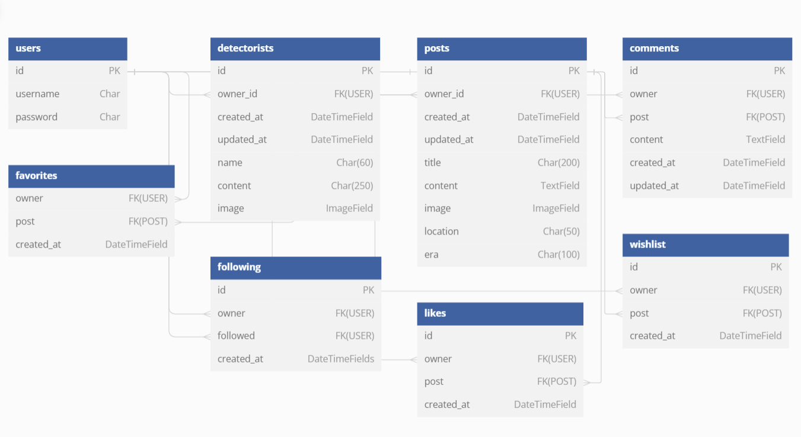

# Lost-Legends - API

This is the backend API for the Lost Legends Frontend React app. It contains the models and logic to allow the frontend application to perform CRUD operations.

Lost Legends is a content-sharing platform designed for metal detecting enthusiasts: users can sign up, share their remarkable discoveries, save and react to finds, as well as follow or unfollow other users.

## Table of Content

## Database
The Lost-Legends API utilizes the following database schema:

## Wishlist

This model represents the list of posts that a user wants to keep track of. It is related to the User model (as the owner of the wishlist) and the Post model.

## Comments

This model represents comments made by users. It is associated with the User model (as the owner of the comment) and the Post model. In addition to the content of the comment, it keeps track of the times when each comment was created and last updated.

## Following

This model maintains the following relationships between users. It is related to the User model twice, once for the owner of the follow (the follower) and once for the followed user. A timestamp of each follow event is also stored.

## Likes

This model captures the likes given by users to a post. It is linked to the User and Post. It also records the time when each like event was created.

## Posts

This model represents the posts made by users. It is related to the User model as the owner of the post. It keeps track of the times when each post was created and last updated, along with the content of the post including the title, image, location information and the era type of find.

## Detectorists

This model extends the User model with additional detectorist-specific information such as their name, profile image, and other personal details. It also keeps timestamps of when each detectorist profile was created and last updated. The creation of a Detectorist object is automatically triggered by the creation of a User object, thanks to the post_save signal connected to the create_detectorist function.

## Favorites

This model represents the list of posts that a user wants to keep track of. It is related to the User model (as the owner of the Favorites) and the Post model.

Each of these models serves a unique purpose and together they support a range of features in your application, from user registration and social networking to content creation and curation.

